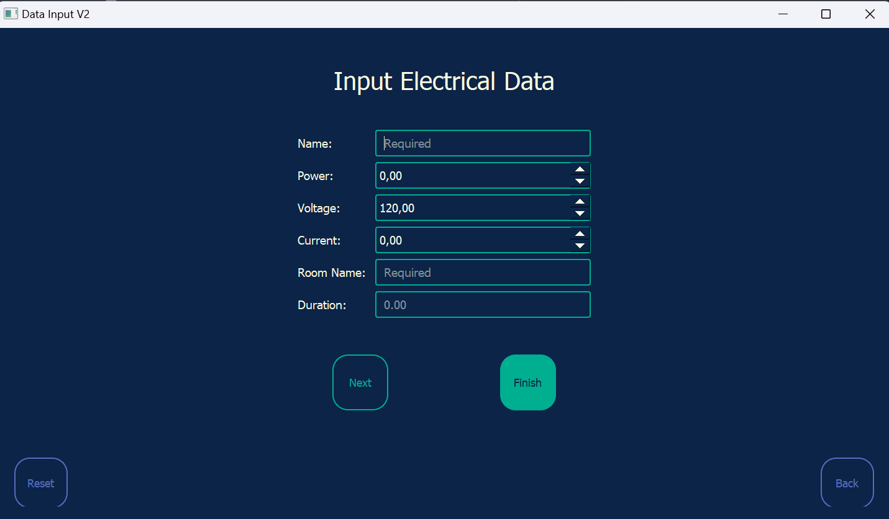
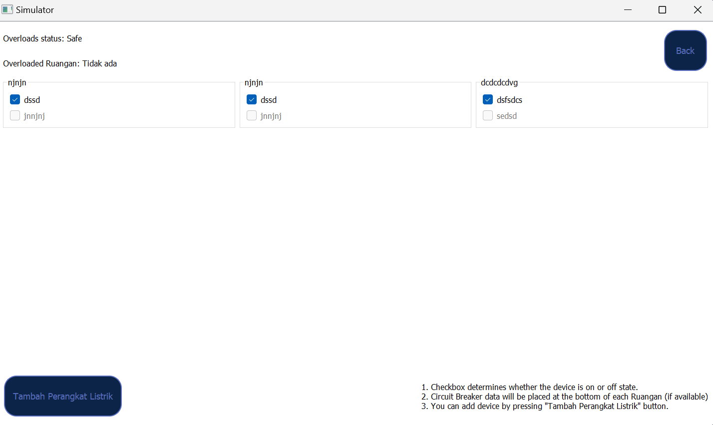
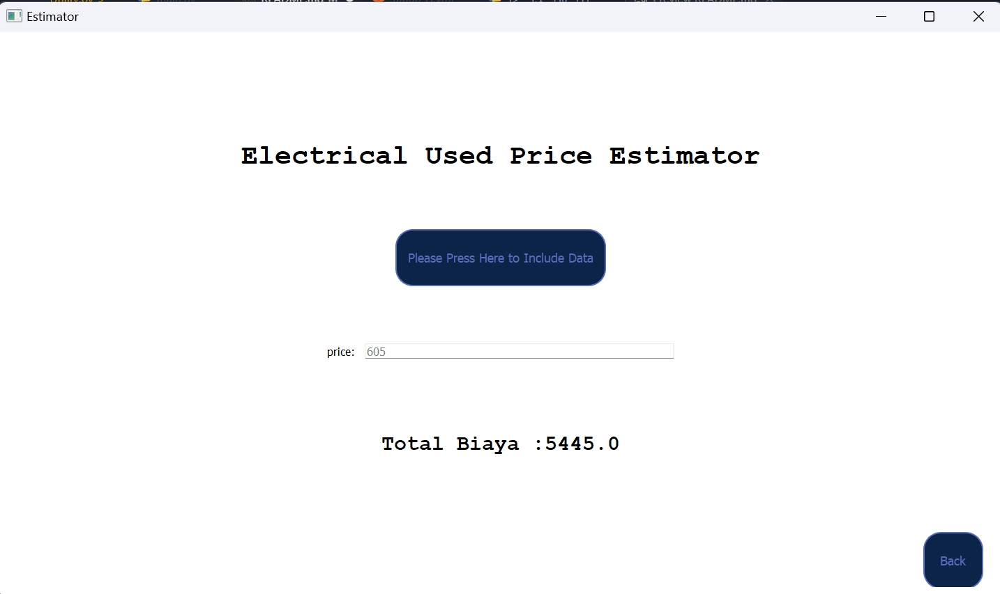
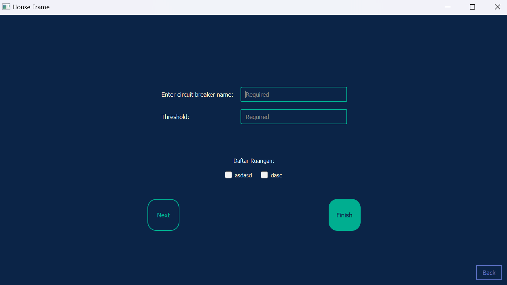

# Watt-De-House

# General Information
Program ini dibuat untuk menyelesaikan Tugas Implementasi IF2250 Rekayasa Perangkat Lunak. Program ini memiliki dua fitur utama yaitu Estimator dan Simulator. Fitur Estimator berfungsi untuk mengkalkulasi perkiraan biaya yang harus dikeluarkan untuk konsumsi listrik. Fitur ini meminta input data perangkat listrik serta estimasi durasi penggunaan dari perangkat listrik tersebut. Fitur Simulator berfungsi untuk melakukan simulasi perangkat listrik yang ada di rumah. Fitru ini meminta input data perangkat listrik, circuit breaker, dan ruangan. Setelah itu, program aka mensimulasikan apakah terjadi electrical overload atau tidak jika perangkat listrik dinyalakan secara bersamaan. 

# How To Run Program
1. Clone repository
```bash
git clone "https://gitlab.informatika.org/Jimly-Firdaus/watt-de-house.git"
```
2. Go into the dictionary in which the repo is cloned

3. Enter src
```bash
cd src
```
4. Run the program
```bash
python main.py
```

# Daftar Module
1. Modul Data Input\

    <p>Gambar 1. Tampilan Data Input</p>

2. Modul Simulator\

    <p>Gambar 2. Tampilan Simulator</p>

3. Modul Estimator\

    <p>Gambar 3. Tampilan Estimator</p>

4. Modul Ruangan \

    <p>Gambar 3. Tampilan Ruangan</p>

5. Modul Perangkat Listrik
# Database
## 1. perangkat_listrik
This table is used to store the information regarding any electrical devices that is used in the program
Attribute | Constraint
----- | -----
id | Integer, Primary Key
status | Integer
nama | Text
daya | Real
arus | Real
tegangan | Real
nama_ruangan | Text
durasi | Integer
## 2. ruangan
This table is used to store the rooms in the houseframe
Attribute | Constraint
----- | -----
id | Integer, Primary Key
nama_ruangan | Text
circuit_breaker | Integer
circuit_breaker_name | Text
threshold | Real
## 3. ruangan_perangkat_listrik
This table is used to show relation between the room id and the device id
Attribute | Constraint
----- | -----
id_ruangan | Integer
id_perangkat_listrik | Integer

# Pembagian Tugas

Nama (NIM) | Tugas
----- | -----
Wilson Tansil (13521054) | Simulator, GUI
Bill Clinton (13521064) | Perangkat Listrik, GUI
Jimly Firdaus (13521102) | Data Input, GUI
Ulung Adi Putra (13521122) | Estimator, GUI
Muhammad Zaki Amanullah (13521146) | Ruangan, GUI 
